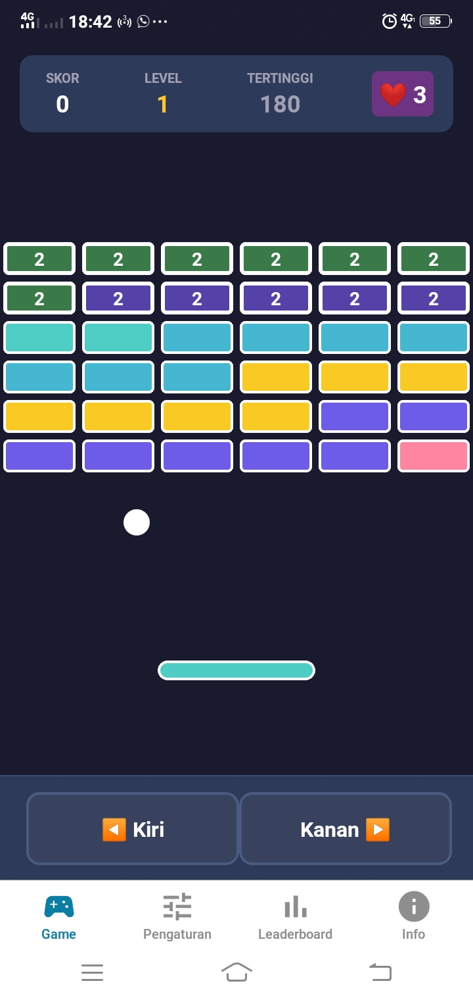
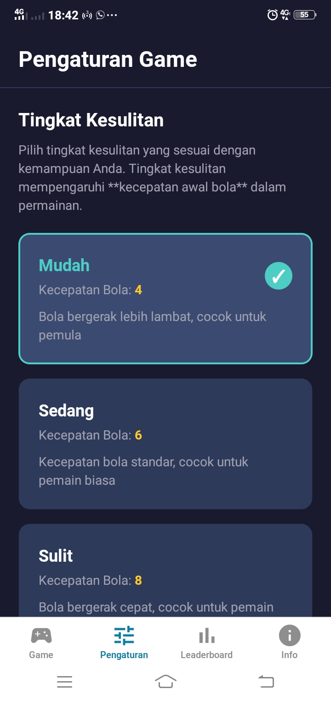
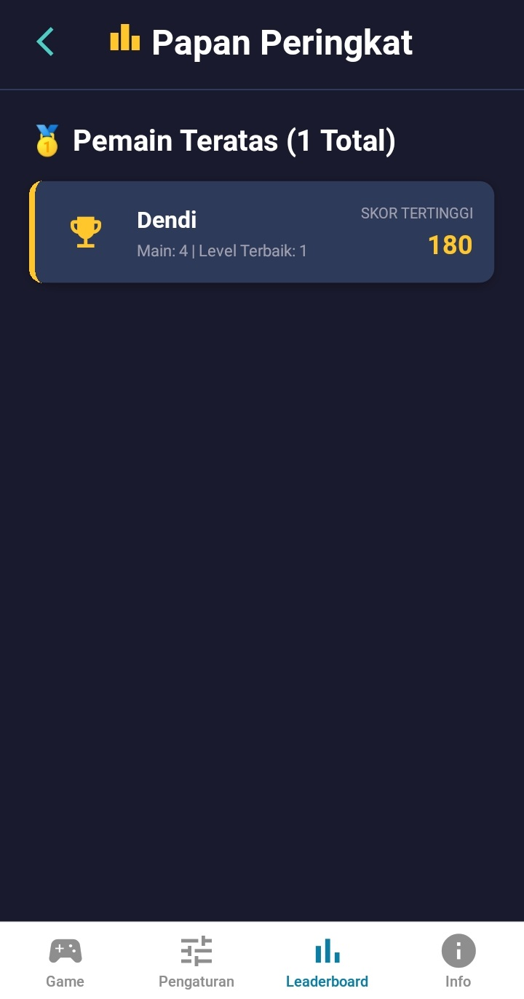
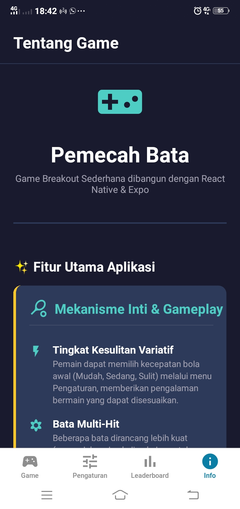

# 🎮 Pemecah Bata - Game Breakout Sederhana

Pemecah Bata adalah implementasi klasik dari game Breakout, dibangun menggunakan React Native dan kerangka kerja Expo. Game ini berfokus pada pengalaman bermain yang lancar di perangkat seluler, dilengkapi dengan fitur manajemen pemain lokal dan papan peringkat (Leaderboard).

## 📸 Screenshot Aplikasi

<div align="center">
  
  
</div>

<div align="center">
  
  
</div>

## ✨ Fitur

- **Gameplay Klasik**: Game Breakout yang menyenangkan dan adiktif
- **Visual Menarik**: Desain modern dengan warna-warna cerah
- **Sistem Skor**: Skor dan skor tertinggi yang tersimpan
- **Level System**: Level meningkat otomatis saat semua bata hancur
- **Kontrol Mudah**: Kontrol Menggunakan Joystick kiri dan kanan
- **Tingkat Kesulitan Variatif**: Pemain dapat mengatur kecepatan bola awal (Mudah, Sedang, Sulit) untuk menyesuaikan tantangan.
- **Bata Multi-Hit**: Menyertakan bata yang memerlukan dua kali pukulan untuk dihancurkan, menambah elemen strategi.

## 🛠 Teknologi yang Digunakan

- **React Native**: Framework untuk membangun aplikasi mobile
- **Expo**: Platform untuk pengembangan React Native
- **TypeScript**: Bahasa pemrograman dengan type safety
- **Animated API**: Untuk animasi yang halus
- **React Hooks**: Untuk manajemen state

## 📦 Persyaratan

Sebelum memulai, pastikan Anda telah menginstall:

- **Node.js** (versi 16 atau lebih tinggi)
- **npm** atau **yarn**
- **Expo CLI**: `npm install -g expo-cli`
- **Expo Go** (untuk testing di mobile): Download dari [App Store](https://apps.apple.com/app/expo-go/id982107779) atau [Google Play](https://play.google.com/store/apps/details?id=host.exp.exponent)

## 🚀 Instalasi

1. **Clone repository ini**
   ```bash
   git clone https://github.com/DendiPratamaRiawan/game-pemecah-bata.git
   cd game-tetris-pemecah_bata
   ```

2. **Install dependencies**
   ```bash
   npm install
   ```
   atau
   ```bash
   yarn install
   ```

## ▶️ Cara Menjalankan

### Development Mode

1. **Jalankan development server**
   ```bash
   npm start
   ```
   atau
   ```bash
   yarn start
   ```

2. **Pilih platform yang ingin digunakan:**
   - Tekan `a` untuk Android
   - Tekan `i` untuk iOS (hanya macOS)
   - Tekan `w` untuk Web
   - Scan QR code dengan Expo Go app di smartphone Anda

### Build untuk Production

#### Android
```bash
npm run android
```

#### iOS (hanya macOS)
```bash
npm run ios
```

#### Web
```bash
npm run web
```

## 🎮 Cara Bermain

1. **Mulai Game**: Ketuk layar untuk memulai permainan
2. **Gerakkan Papan**: control menggunakan joystick kontrol untuk menggerakkan papan ke kiri atau kanan
3. **Hancurkan Bata**: Pantulkan bola ke bata untuk menghancurkannya
4. **Jangan Biarkan Bola Jatuh**: Jaga bola agar tetap memantul di layar
5. **Kumpulkan Skor**: Setiap bata yang hancur memberikan 10 poin
6. **Naik Level**: Hancurkan semua bata untuk naik ke level berikutnya

### Tips Bermain

- ⚡ **Gunakan Sudut**: Pantulkan bola dengan sudut yang berbeda untuk mencapai bata yang sulit dijangkau
- 🎯 **Aim dengan Tepat**: Posisi papan saat bola memantul menentukan arah bola
- 🏆 **Fokus pada Bata**: Prioritaskan menghancurkan semua bata daripada hanya menjaga bola tetap hidup
- 💪 **Latihan**: Semakin sering bermain, semakin baik kontrol Anda

## 🐛 Troubleshooting

### Masalah Umum

1. **Game tidak bisa dimulai**
   - Pastikan semua dependencies terinstall: `npm install`
   - Restart development server: `npm start`

2. **Papan tidak bisa digerakkan**
   - Pastikan game sudah dimulai (tap layar untuk mulai)
   - Coba restart aplikasi

3. **Bola tidak memantul dengan benar**
   - Pastikan collision detection bekerja dengan baik
   - Periksa konstanta kecepatan bola

⭐ Jika Anda menyukai proyek ini, jangan lupa berikan star di GitHub!
